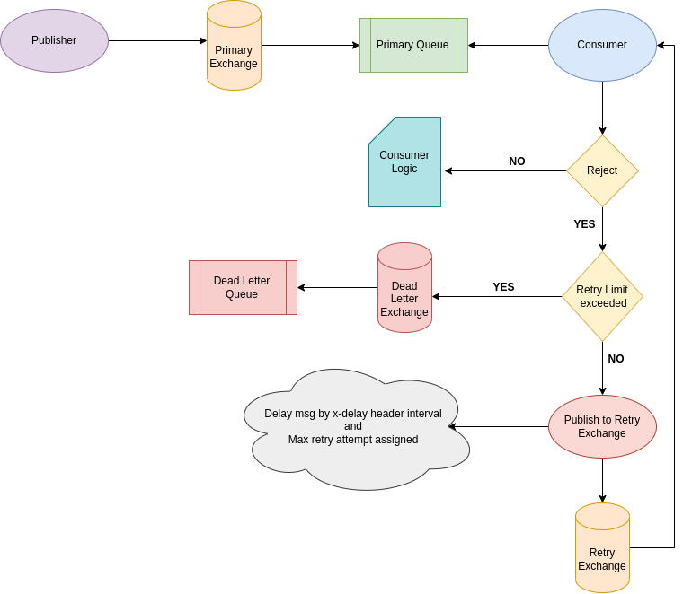

# RabbitMQ Dead Letter Queue

## Prerequisites
- Local RabbitMQ installation
- [rabbitmq-delayed-message-exchange](https://github.com/rabbitmq/rabbitmq-delayed-message-exchange/releases) plugin enabled. Refer to [this guide](http://www.freekb.net/Article?id=3184) for installation and plugin activation.
- Node.js

## Overview
This repository covers the following key points:

1. **Message Publishing:** Utilize a message publisher to send a high volume of messages to the primary queue.
2. **Consumer Implementation:** Implement a consumer to receive and process the incoming messages.
3. **Server Mocking:** Create a server (`server.js`) simulating an external API, running on port 8000, to handle message processing.
4. **Watcher Implementation:** Develop a watcher to monitor both the dead letter queue and server uptime, taking appropriate actions.
5. **Retry Mechanism:** Messages failing processing will be requeued with incremental delays to avoid overloading the processing system.
6. **Dead Letter Queue:** Implement a dead letter queue to store messages that consistently fail processing, preventing indefinite retries.
7. **Scheduler Integration:** A scheduler monitors the dead letter queue's size and transfers messages back to the primary queue when conditions normalize.

## Configuration Details
- **Consumer Prefetch:** Configure the consumer with a prefetch setting to determine the number of messages a consumer can handle concurrently.
- **Durable Flags:** Set the durable flag to `true` for both queues and exchanges, ensuring message persistence even during RabbitMQ service restarts.

## Flow Diagram
The flow of the Dead Letter Queue is visually represented in the following diagram:

This diagram illustrates the entire process, from message publishing to dead letter queue handling and eventual message reprocessing.